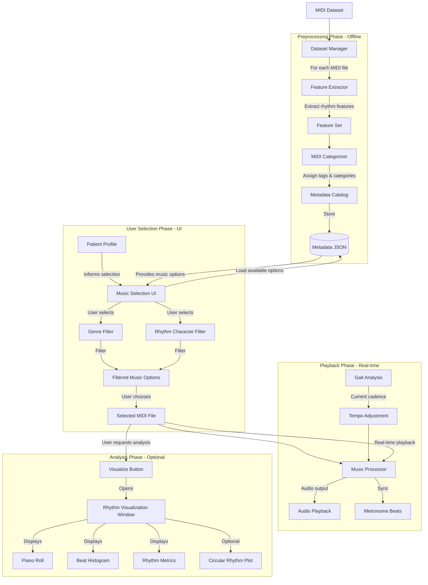
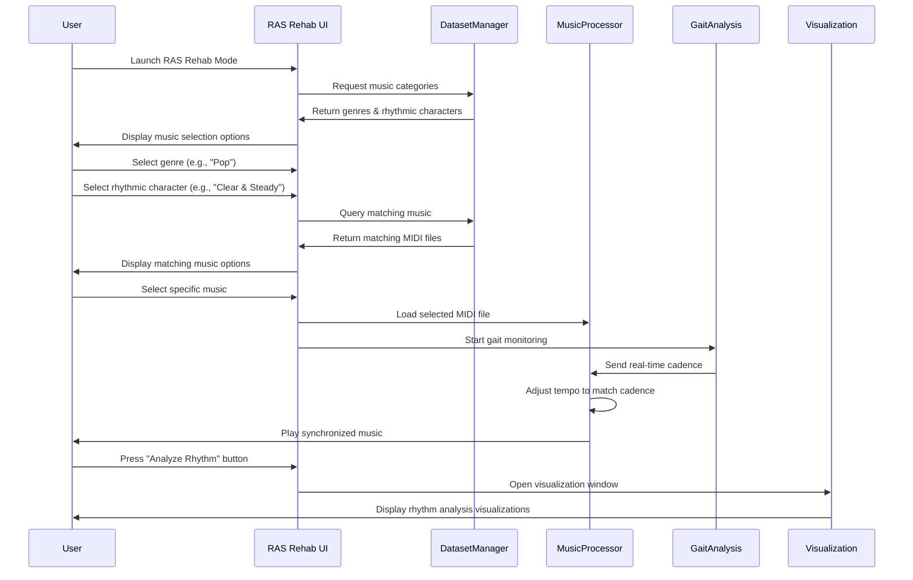

# Music Analysis Workflow Diagram

The following diagram illustrates the complete workflow of music analysis in the NeuroApp_RAS system, from dataset processing to music playback during gait rehabilitation.

## User Interface Flow

