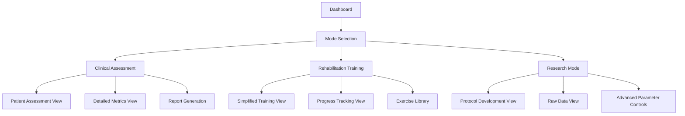

## Main Interface Components

### 1. Main Dashboard Layout

```
┌────────────────────────────────────────────────────────────────────────┐
│ [Logo] RAS-helper                            [Patient] [Session] [⚙️] │
├────────────────────────────────────────────────────────────────────────┤
│                                                                        │
│  ┌─────────────────────┐  ┌─────────────────────┐  ┌─────────────────┐ │
│  │  PROTOCOL CONTROL   │  │  GAIT PARAMETERS    │  │  MUSIC CONTROL  │ │
│  │  ┌───────────────┐  │  │  ┌───────────────┐  │  │ ┌────────────┐  │ │
│  │  │ BASELINE      │  │  │  │ Cadence:      │  │  │ │Tempo:110 BPM│ │ │
│  │  │ ◉─○─○─○─○─○   │  │  │  │ 110 steps/min │  │  │ │             │ │ │
│  │  └───────────────┘  │  │  ├───────────────┤  │  │ │[- 5%][+ 5%] │ │ │
│  │                     │  │  │ Stride Length:│ │ │ │            │  │ │
│  │  SYNC CONTROL       │  │  │ 1.2 m         │  │  │ │[Select MIDI]│ │ │
│  │  ┌───────────────┐  │  │  ├───────────────┤  │  │ └────────────┘  │ │
│  │  │ [Confirm]     │  │  │  │ Velocity:     │  │  │                 │ │
│  │  │ [Modify]      │  │  │  │ 1.1 m/s       │  │  │ STATUS:        │ │
│  │  │               │  │  │  └───────────────┘  │  │ Awaiting       │ │
│  │  │ [Play/Pause]  │  │  │                     │  │ confirmation   │ │
│  │  │ [Stop]        │  │  │  CONFIDENCE: 92%    │  │                 │ │
│  │  └───────────────┘  │  └─────────────────────┘  │ Session Time:   │ │
│  └─────────────────────┘                           │ 00:10:25        │ │
│                                                    └─────────────────┘ │
├────────────────────────────────────────────────────────────────────────┤
│  TIMELINE / SESSION PROGRESS                                           │
│  [━━━━━━━━━━━●━━━━━━━━━━━━━━━━━━━━━━━━━━━━━━━━━━━━━━━━━━━━━━━━━━━━━━] │
│   BASELINE  │  INTRODUCE_CUEING │  CALIBRATE │  LOTS_OF_CUEING...     │
├────────────────────────────────────────────────────────────────────────┤
│                                                                        │
│  VIDEO FEED (16:9 WIDESCREEN FORMAT)                                   │
│  ┌────────────────────────────────────────────────────────────────────┐│
│  │                                                                    ││
│  │                                                                    ││
│  │                                                                    ││
│  │                      [Camera View with Pose Overlay]               ││
│  │                                                                    ││
│  │                                                                    ││
│  │                                                                    ││
│  └────────────────────────────────────────────────────────────────────┘│
│                                                                        │
│  [Recording: OFF]    [Capture Frame]    [Adjust Camera]    [Zoom: 1x]  │
└────────────────────────────────────────────────────────────────────────┘
```



### 2. Patient/Session Management Screen

```
┌────────────────────────────────────────────────────────────────────────┐
│ [Back to Dashboard]           PATIENT MANAGEMENT                   [⚙️] │
├──────────────────────────────────────────────────────────────────────────┤
│                                                                        │
│  PATIENT INFORMATION          │  SESSION HISTORY                       │
│  ┌─────────────────────┐      │  ┌───────────────────────────────────┐ │
│  │ ID: PAT-00123       │      │  │ Date       │ Duration │ Progress  │ │
│  │ Name: John Doe      │      │  ├───────────────────────────────────┤ │
│  │ Age: 65             │      │  │ 2023-04-10 │ 25:42    │ +15.2%    │ │
│  │ Condition: Stroke   │      │  │ 2023-04-05 │ 30:15    │ +11.8%    │ │
│  │                     │      │  │ 2023-03-28 │ 28:10    │ +8.7%     │ │
│  │ [Edit]              │      │  │                                   │ │
│  └─────────────────────┘      │  │ [View Details] [Export Data]      │ │
│                               │  └───────────────────────────────────┘ │
│  BASELINE METRICS             │                                        │
│  ┌─────────────────────┐      │  PROGRESS CHART                        │
│  │ Initial Cadence:    │      │  ┌───────────────────────────────────┐ │
│  │ 95.3 steps/min      │      │  │                                   │ │
│  │                     │      │  │  [Line chart showing progress      │ │
│  │ Initial Stride:     │      │  │   across sessions]                 │ │
│  │ 0.85 m              │      │  │                                   │ │
│  │                     │      │  │                                   │ │
│  │ Target Cadence:     │      │  │                                   │ │
│  │ 110 steps/min       │      │  │                                   │ │
│  └─────────────────────┘      │  └───────────────────────────────────┘ │
│                               │                                        │
└──────────────────────────────────────────────────────────────────────────┘
```

### 3. Real-time Analysis View

```
┌────────────────────────────────────────────────────────────────────────┐
│ [Back to Dashboard]           REAL-TIME ANALYSIS                   [⚙️] │
├──────────────────────────────────────────────────────────────────────────┤
│                               │                                        │
│  VIDEO FEED                   │  GAIT PARAMETERS (REAL-TIME)           │
│  ┌─────────────────────┐      │  ┌───────────────────────────────────┐ │
│  │                     │      │  │ [Graph: Cadence over time]        │ │
│  │                     │      │  │                                   │ │
│  │                     │      │  └───────────────────────────────────┘ │
│  │                     │      │  ┌───────────────────────────────────┐ │
│  │                     │      │  │ [Graph: Stride Length over time]  │ │
│  │                     │      │  │                                   │ │
│  │                     │      │  └───────────────────────────────────┘ │
│  │                     │      │                                        │
│  └─────────────────────┘      │  SYNCHRONIZATION METRICS              │
│                               │  ┌───────────────────────────────────┐ │
│  POSE DETECTION              │  │ Current Phase: CALIBRATE           │ │
│  ┌─────────────────────┐      │  │                                   │ │
│  │ [Skeleton overlay   │      │  │ Target Progress: 45%              │ │
│  │  on alternate view] │      │  │ [━━━━━━━━━━━━━●━━━━━━━━━━━━━━━━━] │ │
│  │                     │      │  │                                   │ │
│  │                     │      │  │ Music Tempo: 115 BPM              │ │
│  └─────────────────────┘      │  │ Current Cadence: 112.3 steps/min  │ │
│                               │  └───────────────────────────────────┘ │
└──────────────────────────────────────────────────────────────────────────┘
```

### 4. Data Analysis & Report Screen

```
┌────────────────────────────────────────────────────────────────────────┐
│ [Back to Dashboard]           SESSION ANALYSIS                     [⚙️] │
├──────────────────────────────────────────────────────────────────────────┤
│                                                                        │
│  SESSION SUMMARY              │  PHASE BREAKDOWN                       │
│  ┌─────────────────────┐      │  ┌───────────────────────────────────┐ │
│  │ Session ID: S-0089  │      │  │ Phase      │ Duration │ Progress  │ │
│  │ Date: 2023-04-12    │      │  ├───────────────────────────────────┤ │
│  │ Duration: 28:15     │      │  │ BASELINE   │ 05:10    │ Baseline  │ │
│  │                     │      │  │ INTRODUCE  │ 06:25    │ +2.3%     │ │
│  │ Baseline: 98.2      │      │  │ CALIBRATE  │ 08:40    │ +10.5%    │ │
│  │ Final: 112.5        │      │  │ LOTS_OF    │ 05:15    │ +14.2%    │ │
│  │ Improvement: +14.6% │      │  │ STABLE     │ 02:45    │ Stable    │ │
│  └─────────────────────┘      │  └───────────────────────────────────┘ │
│                               │                                        │
│  METRICS OVER TIME            │  ADDITIONAL METRICS                    │
│  ┌─────────────────────┐      │  ┌───────────────────────────────────┐ │
│  │                     │      │  │ Entrainment Error: 0.053          │ │
│  │ [Multi-line graph   │      │  │                                   │ │
│  │  showing cadence,   │      │  │ Cadence Variability: 2.8          │ │
│  │  tempo, and target  │      │  │                                   │ │
│  │  over time]         │      │  │ Gait Symmetry: 87%                │ │
│  │                     │      │  │                                   │ │
│  │                     │      │  │ Notes: Patient showed good        │ │
│  │                     │      │  │ adaptation to tempo changes       │ │
│  └─────────────────────┘      │  └───────────────────────────────────┘ │
│                               │                                        │
│  [Export PDF]  [Export CSV]   │  [Print Report]  [Save to Patient Record] │
└──────────────────────────────────────────────────────────────────────────┘
```

## Key Interactive Elements

### 1. SLICE Protocol Navigation
- **Phase Indicator**: Visual representation of the current protocol phase
- **Phase Selector**: Allows therapist to select and switch between phases
- **Timeline View**: Shows progress through the session and protocol phases

### 2. Gait-Music Synchronization Controls
- **Confirm Button**: Accepts the current gait measurement for tempo setting
- **Modify Button**: Opens a dialog to manually adjust the cadence
- **Tempo Adjustment**: Fine-tune music tempo with +/- buttons or slider
- **Music Selection**: Choose appropriate MIDI files for the session

### 3. Data Visualization
- **Real-time Graphs**: Display cadence, stride length, and velocity
- **Pose Overlay**: Show skeleton tracking on the video feed
- **Synchronization Metrics**: Display entrainment progress and errors

### 4. Session Management
- **Patient Profiles**: Create and select patient records
- **Session History**: View past sessions and progress
- **Data Export**: Generate reports and export session data

## Workflow Design

The UI workflow should mirror the SLICE protocol stages:

### 1. Setup Phase
- Select/create patient profile
- Configure camera and verify pose detection
- Set session parameters (target cadence, etc.)

### 2. Baseline Assessment
- Record natural gait parameters
- Display real-time metrics
- Save baseline measurements

### 3. Cueing Introduction
- Confirm initial gait parameters
- Select appropriate music
- Start playback matched to current cadence

### 4. Calibration & Adaptation
- Gradually adjust tempo
- Monitor entrainment (how well patient follows)
- Display progress toward target

### 5. Analysis & Reporting
- Display session summary
- Show progress charts
- Generate clinical reports

## Design Considerations

### Clinical Usability
- **Visibility**: Large, clear displays of critical parameters
- **Efficiency**: Single-click access to common functions
- **Keyboard Shortcuts**: For quick operation during therapy
- **Status Messages**: Clear feedback on system state and required actions

### Technical Implementation
- **Framework Options**:
  - PyQt/PySide for desktop application
  - Flask/Django with Web UI for cross-platform use
  - Electron for desktop performance with web technologies
- **Responsive Design**: Adjustable layouts for different screen sizes
- **Clean Data Separation**: UI should only interact with core modules through well-defined interfaces

### Accessibility Features
- **High Contrast Mode**: For visibility in various clinical settings
- **Color-blind Friendly**: Use patterns and shapes in addition to colors
- **Keyboard Navigation**: Complete operation without mouse when needed
- **Voice Commands**: Optional voice control for hands-free operation

## Implementation Plan

1. **Mockup Creation**: Develop interactive wireframes for user testing
2. **Component Architecture**: Design modular UI components that connect to core modules
3. **Core Screens Implementation**: Build the main dashboard and gait analysis views
4. **Data Visualization**: Implement real-time graphs and feedback mechanisms
5. **Testing & Refinement**: Conduct usability testing with therapists
6. **Documentation**: Create user guides and help documentation

## Next Steps

1. Choose a UI framework based on deployment needs (desktop vs. web)
2. Create detailed mockups of the main screens
3. Implement a minimal viable interface focusing on the crucial synchronization workflow
4. Integrate with existing core modules through clean APIs
5. Conduct usability testing with potential users (physical therapists)

Would you like me to elaborate on any specific aspect of this UI design, or should we move forward with selecting a framework and creating more detailed mockups?
